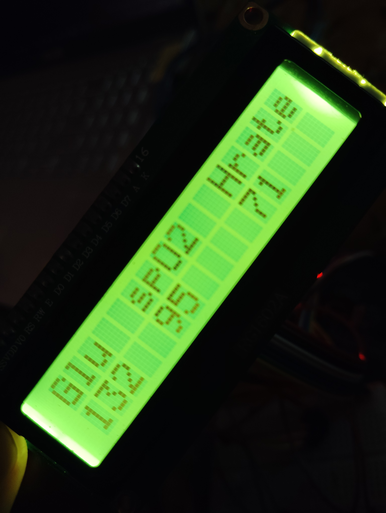
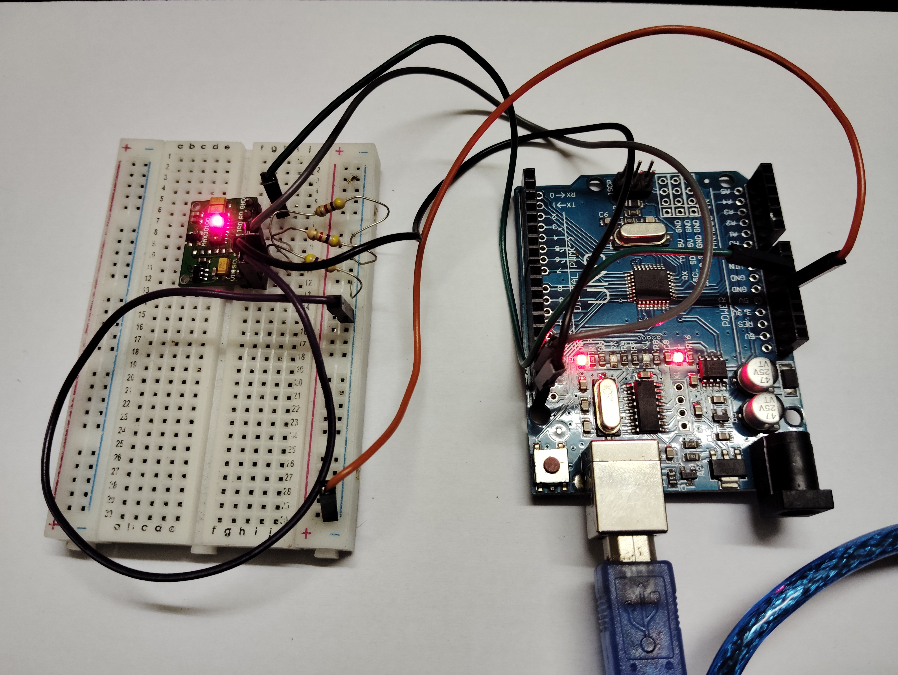

# Non-Invasive Blood Glucose Measurement Device

## Overview

The non-invasive blood glucose measurement device utilizes NIR (Near Infrared) spectroscopy to estimate glucose levels without invasive blood sampling. Here are the main components:
1. **MAX30100 Sensor:**
   - The heart of the device, the MAX30100 sensor, serves as a pulse oximeter.
   - It features both a Red LED and an IR LED.
   - The output voltages from these LEDs are mapped to determine the patient's glucose value.

2. **Working Principle:**
   - The IR LED emits infrared light, which passes through the patient's fingertip.
   - Glucose molecules in the blood absorb varying amounts of IR light.
   - The sensor measures the absorbed light and provides a corresponding voltage.
   - The IR voltage is inversely proportional to the patient's glucose level.

3. **LCD Display:**
   - The device displays essential information on an LCD screen.
   - The following parameters are shown:
     - Glucose level
     - Oxygen saturation
     - Heart rate

## How It Works

1. **Glucose Measurement:**
   - The device calculates glucose levels based on the IR absorption.
   - Real glucose values from experiments are used to map the sensor's output voltage.

2. **Oxygen Saturation:**
   - The oxygen saturation level is also measured alongside glucose.
   - Both parameters are displayed on the LCD screen.

3. **Heart Rate Monitoring:**
   - The device provides real-time heart rate measurements.

## Future Improvements

1. **Display Enhancement:**
   - Consider upgrading to a high-quality display for better aesthetics.
   - A visually appealing interface enhances user experience.

2. **Size Reduction:**
   - Explore ways to reduce the device's physical size while maintaining functionality.

## Conclusion

The non-invasive blood glucose measurement device combines hardware components and Arduino programming to revolutionize glucose monitoring. Its IoT-based approach offers a hygienic and user-friendly alternative to traditional methods.

Feel free to customize this README with additional details, installation instructions, and usage guidelines. Good luck with your project! 🌟
